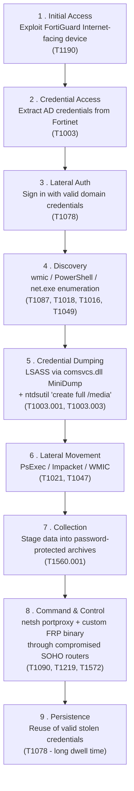

# Lab 1 - Cyber Threat Intelligence: Volt Typhoon

## 1. Group Members
- Stav Hefetz *(individual submission - permitted by the course email of 21 April: "You may work in groups of 2-3 students, or individually if needed.")*

## 2. Source CTI Report
**Microsoft Threat Intelligence - *"Volt Typhoon targets US critical infrastructure with living-off-the-land techniques"*** (May 24, 2023)

https://www.microsoft.com/en-us/security/blog/2023/05/24/volt-typhoon-targets-us-critical-infrastructure-with-living-off-the-land-techniques/

Companion advisory:
- NSA / CISA / FBI joint advisory: https://media.defense.gov/2023/May/24/2003229517/-1/-1/0/CSA_Living_off_the_Land.PDF

---

## 3. Short Attack Summary

**Volt Typhoon** (also tracked as `STORM-0391`) is a Chinese state-sponsored threat group that has been active since at least mid-2021, focused on espionage and pre-positioning against United States critical infrastructure. Microsoft observed the actor compromising organizations across the communications, manufacturing, utility, transportation, government, IT, and maritime sectors - with the early focus on Guam being strategically notable due to its proximity to the Asia-Pacific theater.

The group's defining characteristic is its near-exclusive use of **living-off-the-land (LOTL)** techniques: instead of dropping conventional malware, Volt Typhoon abuses built-in Windows utilities (`wmic`, `ntdsutil`, `netsh`, `PowerShell`, `cmd`) so that their activity blends into normal administrative traffic and evades signature-based detection.

Initial access is gained by exploiting internet-facing **Fortinet FortiGuard** devices, from which Active Directory credentials are extracted and reused to authenticate into the victim network. Command-and-control traffic is then **proxied through compromised small-office / home-office (SOHO) routers** (ASUS, Cisco RV-series, D-Link, NETGEAR, Zyxel) so the inbound traffic appears to originate from benign residential IPs in the same geography as the victim.

Microsoft assesses with **moderate confidence** that the campaign is intended to **develop the capability to disrupt communications infrastructure between the U.S. and Asia during a future crisis** - i.e. this is *prepositioning* for destructive operations, not opportunistic data theft. That makes it qualitatively different from financially motivated intrusions, and is why the NSA released a coordinated public advisory the same day.

---

## 4. Attack Diagram / Sequence

**Step-by-step narrative:**

1. **Foothold** on an exposed Fortinet FortiGuard appliance.
2. **Credential extraction** from the appliance yields domain accounts.
3. **Authenticated entry** into the corporate network using those accounts.
4. **Discovery** with built-in tools - system info, accounts, network shares, AD topology.
5. **Credential dumping** - LSASS process memory and the NTDS.dit Active Directory database are extracted offline for hash cracking.
6. **Lateral movement** with custom Impacket and standard Windows admin tools.
7. **Data staging** into password-protected archives (typically `.rar` or `.7z`).
8. **Egress** is tunneled through `netsh` port-forwarding and a customized **FRP (Fast Reverse Proxy)** binary; the outbound connection terminates on a compromised SOHO router that *fronts* the actual operator infrastructure.
9. **Long-term persistence** is maintained simply by re-using valid credentials - no implants, no scheduled tasks, no services.

---

## 5. MITRE ATT&CK Mapping

| Tactic | Technique (ID) | Behavior in the report | ATT&CK link |
|---|---|---|---|
| Initial Access | **T1190** - Exploit Public-Facing Application | Exploitation of internet-exposed Fortinet FortiGuard devices | https://attack.mitre.org/techniques/T1190/ |
| Initial Access / Persistence | **T1078** - Valid Accounts | Use of stolen domain credentials to log in and stay in | https://attack.mitre.org/techniques/T1078/ |
| Execution | **T1059.001** - PowerShell | PowerShell used for discovery and execution | https://attack.mitre.org/techniques/T1059/001/ |
| Execution | **T1059.003** - Windows Command Shell | `cmd.exe` and base64-encoded one-liners | https://attack.mitre.org/techniques/T1059/003/ |
| Execution | **T1047** - Windows Management Instrumentation | `wmic` used for execution and remote discovery | https://attack.mitre.org/techniques/T1047/ |
| Defense Evasion | **T1027** - Obfuscated Files or Information | Base64-encoded command lines | https://attack.mitre.org/techniques/T1027/ |
| Defense Evasion | **T1070.004** - File Deletion | Cleanup of staged archives after exfil | https://attack.mitre.org/techniques/T1070/004/ |
| Credential Access | **T1003.001** - LSASS Memory | `rundll32 comsvcs.dll MiniDump <PID>` to dump LSASS | https://attack.mitre.org/techniques/T1003/001/ |
| Credential Access | **T1003.003** - NTDS | `ntdsutil "create full /media …"` to dump NTDS.dit | https://attack.mitre.org/techniques/T1003/003/ |
| Discovery | **T1087** - Account Discovery | Enumeration of local and domain accounts | https://attack.mitre.org/techniques/T1087/ |
| Discovery | **T1057** - Process Discovery | Enumeration of running processes | https://attack.mitre.org/techniques/T1057/ |
| Discovery | **T1018** - Remote System Discovery | `ping` sweeps and network mapping | https://attack.mitre.org/techniques/T1018/ |
| Discovery | **T1016** - System Network Configuration Discovery | `ipconfig`, `route print`, `netstat` | https://attack.mitre.org/techniques/T1016/ |
| Discovery | **T1049** - System Network Connections Discovery | `netstat`, queries for active sessions | https://attack.mitre.org/techniques/T1049/ |
| Discovery | **T1497** - Virtualization / Sandbox Evasion | Checks for virtualized environments before execution | https://attack.mitre.org/techniques/T1497/ |
| Lateral Movement | **T1021.002** - SMB / Windows Admin Shares | Movement using admin shares with valid creds | https://attack.mitre.org/techniques/T1021/002/ |
| Lateral Movement | **T1570** - Lateral Tool Transfer | Custom Impacket pushed to remote hosts | https://attack.mitre.org/techniques/T1570/ |
| Collection | **T1560.001** - Archive via Utility | Password-protected `.rar` / `.7z` archives staged for exfil | https://attack.mitre.org/techniques/T1560/001/ |
| Command & Control | **T1090.001** - Internal Proxy | `netsh interface portproxy add v4tov4 …` for internal pivoting | https://attack.mitre.org/techniques/T1090/001/ |
| Command & Control | **T1090.002** - External Proxy | C2 traffic relayed through compromised SOHO routers | https://attack.mitre.org/techniques/T1090/002/ |
| Command & Control | **T1219** - Remote Access Software | Custom build of Fast Reverse Proxy (FRP) | https://attack.mitre.org/techniques/T1219/ |
| Command & Control | **T1572** - Protocol Tunneling | Tunneling C2 over the SOHO router relay network | https://attack.mitre.org/techniques/T1572/ |

### Concrete commands observed (mapped)

| Observed command | Maps to |
|---|---|
| `rundll32.exe C:\Windows\System32\comsvcs.dll MiniDump <PID> C:\Windows\Temp\lsass.bin full` | T1003.001 |
| `ntdsutil "ac i ntds" "ifm" "create full C:\DCMedia" q q` | T1003.003 |
| `netsh interface portproxy add v4tov4 listenport=
 connectaddress=<IP> connectport=
` | T1090.001 |
| `cmd.exe /c <base64-encoded payload>` | T1027 + T1059.003 |

---

## 6. Insights / What I Learned

The most striking thing about Volt Typhoon is that **the absence of malware *is* the tradecraft** - every step relies on tools that already ship with Windows or on a compromised home router thousands of miles from the target, so traditional EDR signatures, network-IOC blocklists and AV hashes have almost nothing to bite on. That forces defense to shift from artifact-hunting to **behavioral** detection: an `ntdsutil "create full /media"` from a non-DC-admin account, or a `netsh portproxy` rule appearing on a workstation, is the actual signal.

It also reframed for me what a "campaign" can be *for*. Volt Typhoon is not stealing money or even data of immediate intelligence value - it is **prepositioning access** in critical infrastructure that would only be activated during a geopolitical crisis. The relevant defensive question is therefore not "what did they take?" but "**how long have they had a key, and would we notice them turning it?**"
