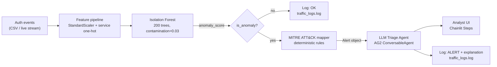

# System architecture (Stage 9)

## 1. High-level view



## 2. Component responsibilities

| Component | File | Responsibility | Owner |
|---|---|---|---|
| Data generator | `data/generate.py` | Produces the synthetic auth-event CSV with three labelled attack profiles | Code |
| Feature pipeline | `src/detector.py` (`_featurise`) | Maps a raw event dict to the model's feature vector | Code |
| Detector | `src/detector.py` (`AnomalyDetector`) | Wraps the trained Isolation Forest + scaler; produces `(is_anomaly, score)` | Code |
| Mapper | `src/mitre_mapper.py` | Rule-based assignment of MITRE technique ID; **no LLM involvement** | Code |
| Alert object | `src/alert.py` | The structured contract between mapper and LLM. The LLM only ever sees this. | Code |
| Triage agent | `src/triage_agent.py` | AG2 `ConversableAgent` that converts an Alert into a natural-language summary | LLM (constrained) |
| UI | `app/app.py` | Chainlit handlers, step rendering, replay button, free-form chat | Code |
| Logger | `src/logger.py` | Persists every decision (OK or ALERT) as a JSON line in `traffic_logs.log` | Code |

## 3. Trust boundaries

There are three trust zones. Drawing them explicitly is what stops the LLM from inventing threat-intel facts.

```
┌──────────────────────────────────────────────────────────┐
│ TRUSTED CORE                                             │
│   detector.py    -- code we wrote and tested             │
│   mitre_mapper.py -- code we wrote and tested            │
│   alert.py        -- data class, no logic                │
│   logger.py       -- code we wrote                       │
└──────────────────────────────────────────────────────────┘
                         │
                         │ Alert object (structured, all fields validated)
                         ▼
┌──────────────────────────────────────────────────────────┐
│ CONSTRAINED LLM ZONE                                     │
│   triage_agent.py -- system prompt FORBIDS new technique │
│                       IDs, IOCs, or actor attributions   │
└──────────────────────────────────────────────────────────┘
                         │
                         │ natural-language summary (audited at log time)
                         ▼
┌──────────────────────────────────────────────────────────┐
│ ANALYST UI                                               │
│   Chainlit Step view -- every tool call is expandable    │
│   traffic_logs.log   -- post-hoc audit trail             │
└──────────────────────────────────────────────────────────┘
```

The rule that makes the architecture defensible: **the LLM never sees raw threat-intel data**. It only sees what the deterministic mapper produced. If the LLM lies, the lie is comparable to the structured input and the lie is auditable.

## 4. Technology choices and trade-offs

| Choice | Alternative we rejected | Why |
|---|---|---|
| Isolation Forest | Autoencoder | Easier to defend in the report, no GPU needed, deterministic, fast to train. Lab 2 also used it. |
| Deterministic rule-based mapper | LLM-based mapper | LLMs hallucinate technique IDs. Course rule (Lab 3): tools do retrieval, LLM only reasons. |
| AG2 ConversableAgent | LangChain | Course standard (Labs 3 and 4 both used AG2). Less ceremony than LangChain. |
| Chainlit | Streamlit / Gradio | Course standard. Tool calls render as expandable Steps -- exactly the audit UI we want. |
| Synthetic data | Public dataset (CIC-IDS) | Public network-flow datasets are not auth-event oriented and would force the project off-topic. |
| Groq (Qwen-32B) | OpenAI / Anthropic | Free tier for students; same OpenAI-compatible API. |
| Docker + Compose | Bare Python | Course standard; reproducible across grader machines. |
