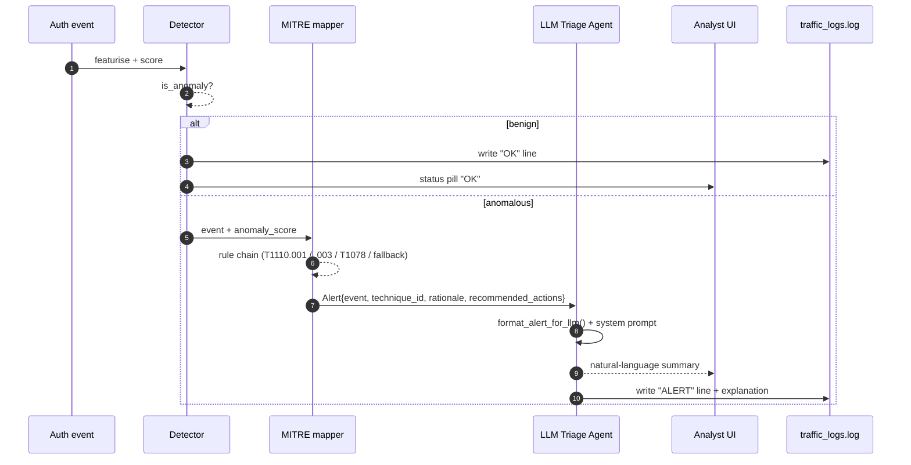
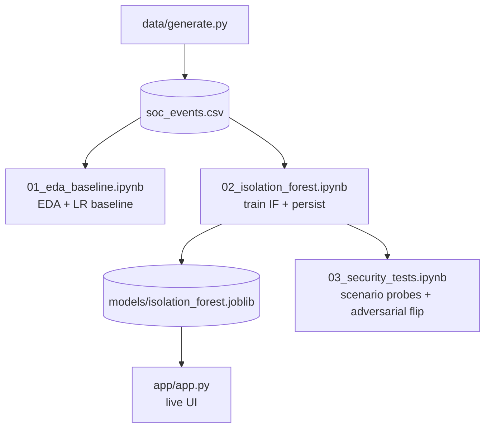
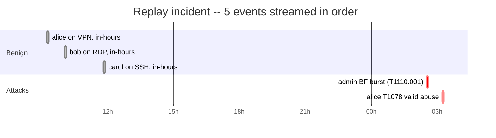

# Workflow diagrams (Stage 9)

## 1. End-to-end alert flow (per event)

## 2. Training & evaluation workflow (offline, build-time)

## 3. Demo scenario timeline (used by the Replay button)

The replay tests *both* the benign path (three "OK" decisions, no LLM call) and the alert path (two ALERTs with full LLM explanation), in roughly 30 seconds of streaming -- ideal for the 2-5 minute demo video.
